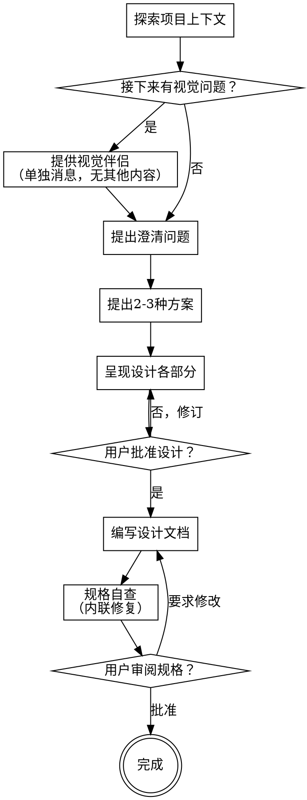

# 将创意头脑风暴为设计方案

通过自然的协作对话，帮助将创意转化为成熟的设计和规格。

首先了解当前项目上下文，然后逐一提问来细化创意。一旦你理解了要构建什么，就呈现设计方案并获得用户批准。

<HARD-GATE>
在呈现设计方案并获得用户批准之前，不得调用任何实施技能、编写任何代码、搭建任何项目或采取任何实施行动。这适用于每个项目，无论其看似多么简单。
</HARD-GATE>

## 反模式："这太简单了，不需要设计"

"简单"项目恰恰是未经审视的假设导致最多浪费的地方。设计可以简短（对于真正简单的项目只需几句话），但你必须呈现它并获得批准。

## 检查清单

你必须为以下每一项创建任务并按顺序完成：

1. **探索项目上下文** — 检查文件、文档、最近的提交
2. **提供视觉伴侣**（如果主题将涉及视觉问题）——这必须是单独的消息，不与澄清问题合并。参见下方视觉伴侣部分。
3. **提出澄清问题** — 逐一提问，理解目的/约束/成功标准
4. **提出2-3种方案** — 附带权衡分析和你的推荐
5. **呈现设计** — 按各部分的复杂度适当扩展，在每个部分后获得用户批准
6. **编写设计文档** — 保存到 `./brainstorm/specs/YYYY-MM-DD-<topic>-design.md`
7. **规格自查** — 快速内联检查占位符、矛盾、歧义、范围（见下文）
8. **用户审阅书面规格** — 请用户在继续之前审阅规格文件

## 流程图

**终止状态是设计规格获得用户批准。** 头脑风暴流程到此完成，后续实施由用户自行决定。

## 流程详解

**理解创意：**

- 首先查看当前项目状态（文件、文档、最近的提交）
- 在提出详细问题之前，评估范围：如果请求描述了多个独立子系统（例如"构建一个包含聊天、文件存储、计费和分析的平台"），立即指出。不要在需要先分解的项目上花时间细化细节。
- 如果项目太大不适合单一规格，帮助用户分解为子项目：独立的部分有哪些，它们如何关联，应该以什么顺序构建？然后通过正常的设计流程对第一个子项目进行头脑风暴。每个子项目都有自己独立的规格和后续实现周期。
- 对于范围适当的项目，逐一提问来细化创意
- 尽可能使用选择题，开放式问题也可以
- 每条消息只问一个问题——如果某个主题需要更多探索，分解为多个问题
- 聚焦于理解：目的、约束、成功标准

**探索方案：**

- 提出2-3种不同方案及其权衡分析
- 以对话方式呈现选项，附带你的推荐和理由
- 首先展示你推荐的方案并解释原因

**呈现设计：**

- 当你相信自己理解了要构建什么时，呈现设计
- 按各部分的复杂度适当扩展：如果简单则几句话，如果复杂则200-300字
- 在每个部分后询问目前为止看起来是否正确
- 涵盖：架构、组件、数据流、错误处理、测试
- 如果某些内容不清楚，随时回过头去澄清

**为隔离和清晰而设计：**

- 将系统分解为更小的单元，每个单元都有明确的目的，通过定义良好的接口通信，并且可以独立理解和测试
- 对于每个单元，你应该能够回答：它做什么、你如何使用它、它依赖什么？
- 某人能否在不阅读内部实现的情况下理解一个单元的功能？你能否在不破坏使用方的情况下更改内部实现？如果不能，边界需要改进。
- 更小的、边界清晰的单元对你来说也更容易处理——你更容易推理一次能放入上下文的代码，当文件聚焦时你的编辑也更可靠。当一个文件变大时，这通常是它承担了过多职责的信号。

**在现有代码库中工作：**

- 在提出变更之前探索当前结构。遵循既有模式。
- 当现有代码存在问题影响到当前工作时（例如文件变得过大、边界不清、职责纠缠），将针对性的改进作为设计的一部分——就像一个优秀的开发者改进他们正在处理的代码那样。
- 不要提议无关的重构。保持聚焦于服务于当前目标的内容。

## 设计之后

**文档：**

- 将验证过的设计（规格）写入 `./brainstorm/specs/YYYY-MM-DD-<topic>-design.md`
  - （用户对规格位置的偏好会覆盖此默认值） （时间可通过 Bash 工具执行 ` date +%Y-%m-%d ` 获取）
- 不要自动提交设计文档，除非用户明确要求

**规格自查：**
编写规格文档后，用新的视角审视它：

1. **占位符扫描：** 是否有"TBD"、"TODO"、不完整的部分或模糊的需求？修复它们。
2. **内部一致性：** 各部分之间是否有矛盾？架构是否与功能描述匹配？
3. **范围检查：** 这是否足够聚焦以适合单次设计，还是需要分解？
4. **歧义检查：** 是否有需求可以被两种不同方式理解？如果是，选择一种并明确说明。

内联修复所有问题。不需要重新审查——修复后继续前进。

**用户审阅关卡：**
规格审查循环通过后，请用户在继续之前审阅书面规格：

> "规格已写入到 `<path>`。请审阅后告诉我是否需要修改。"

等待用户的响应。如果他们要求修改，进行修改并重新运行规格审查循环。仅在用户批准后才继续。

**完成：**

头脑风暴流程到此完成。设计规格已写入并获得用户批准，后续实施由用户自行决定。

## 关键原则

- **逐一提问** - 不要用多个问题让人不知所措
- **优先选择题** - 可能时比开放式问题更容易回答
- **严格执行YAGNI** - 从所有设计中删除不必要的功能
- **探索替代方案** - 在确定之前始终提出2-3种方案
- **增量验证** - 呈现设计，在推进之前获得批准
- **保持灵活** - 当某些内容不清楚时回过头去澄清

## 视觉伴侣

一个基于浏览器的伴侣，用于在头脑风暴过程中展示模型、图表和视觉选项。作为工具可用——不是一种模式。接受伴侣意味着它可用于受益于视觉呈现的问题；这并不意味着每个问题都通过浏览器呈现。

**提供伴侣：** 当你预计接下来的问题将涉及视觉内容（模型、布局、图表）时，一次性提供以征得同意：
> "我们正在处理的内容中，有些可能更容易通过在网页浏览器中展示来解释。我可以在进行过程中制作模型、图表、比较和其他视觉内容。此功能仍较新且可能消耗较多 token。想试试吗？（需要打开一个本地 URL）"

**此提议必须是单独的消息。** 不要将它与澄清问题、上下文摘要或任何其他内容合并。该消息应仅包含上述提议，别无其他。在继续之前等待用户的响应。如果他们拒绝，继续纯文本头脑风暴。

**逐问题决策：** 即使在用户接受后，也要针对每个问题决定是否使用浏览器或终端。判断标准：**用户看到它是否比阅读它更容易理解？**

- **使用浏览器** 展示本身就是视觉的内容——模型、线框图、布局比较、架构图、并排视觉设计
- **使用终端** 展示是文本的内容——需求问题、概念选择、权衡列表、A/B/C/D 文本选项、范围决策

关于UI主题的问题不自动是视觉问题。"在这种语境中个性意味着什么？"是概念问题——使用终端。"哪种向导布局更好？"是视觉问题——使用浏览器。

如果他们同意使用伴侣，在继续之前阅读详细指南：
`./visual-companion.md`